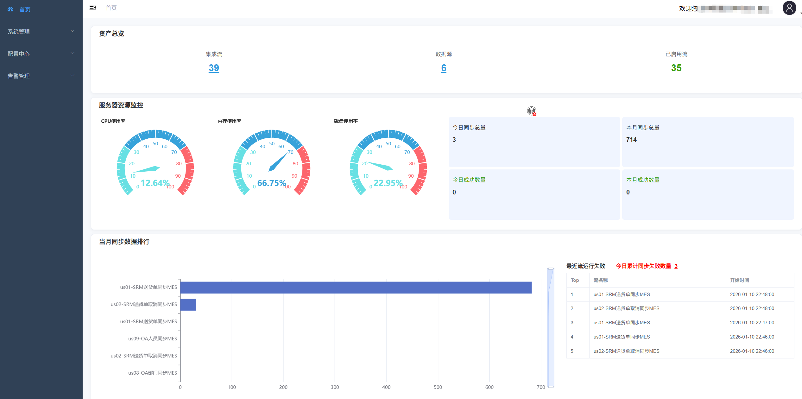
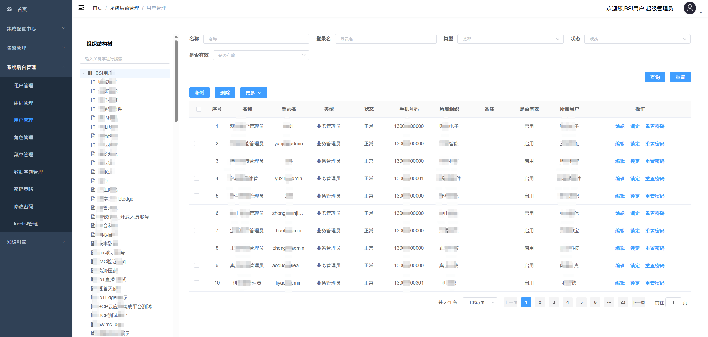
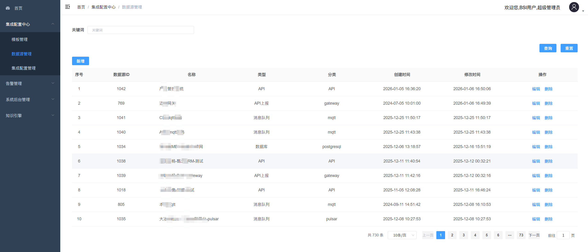

# BCP Admin UI

[](https://github.com/paul-zhang-sudo/bcp-admin-ui/actions/workflows/ci.yml)
[](https://github.com/paul-zhang-sudo/bcp-admin-ui/actions/workflows/docker.yml)
[](https://hub.docker.com/r/zhangbq1681/bcp-admin-ui)
[](LICENSE)
[](https://github.com/paul-zhang-sudo/bcp-admin-ui/stargazers)
[](https://github.com/paul-zhang-sudo/bcp-admin-ui/network/members)
[](https://github.com/paul-zhang-sudo/bcp-admin-ui/issues)
[](https://vuejs.org/)
[](https://element.eleme.io/)
[](https://nodejs.org/)

一个基于 Vue 2.x + Element UI 的企业级后台管理系统，提供数据集成、任务调度、权限管理等功能。

## 项目截图

### 登录页面


### 仪表盘


### 用户管理


### 任务管理


### 数据源配置


## 技术栈

- **前端框架**: Vue 2.x
- **UI 组件库**: Element UI
- **状态管理**: Vuex
- **路由**: Vue Router
- **HTTP 请求**: Axios
- **图表**: ECharts
- **代码编辑器**: Monaco Editor

## 功能模块

- **用户管理**: 用户账号的增删改查、状态管理
- **角色管理**: 角色权限配置、菜单授权
- **菜单管理**: 动态菜单配置
- **组织管理**: 组织架构管理
- **租户管理**: 多租户支持
- **数据源管理**: 多数据源配置与管理
- **任务管理**: 定时任务配置与调度
- **任务监控**: 任务执行记录与统计
- **字典管理**: 系统字典维护
- **告警配置**: 告警规则与通知方式配置
- **接口管理**: ERP 接口与系统接口管理
- **操作日志**: 用户操作记录查询

## 快速开始

### 环境要求

- Node.js >= 8.9
- npm >= 3.0.0

### 安装依赖

```bash
npm install
```

### 开发环境运行

```bash
npm run dev
```

### 生产环境构建

```bash
# 生产环境
npm run build:prod

# UAT 环境
npm run build:uat

# 预发布环境
npm run build:stage
```

### 代码检查

```bash
npm run lint
```

### 运行测试

```bash
npm run test:unit
```

## 项目结构

```
src/
├── api/            # API 接口
├── assets/         # 静态资源
├── components/     # 公共组件
├── icons/          # SVG 图标
├── layout/         # 布局组件
├── router/         # 路由配置
├── store/          # Vuex 状态管理
├── styles/         # 全局样式
├── utils/          # 工具函数
└── views/          # 页面视图
```

## Docker 部署

### 环境要求

- Docker >= 20.10
- Docker Compose >= 2.0

### 快速部署（推荐）

直接从 Docker Hub 拉取镜像，无需本地构建：

```bash
# 拉取镜像
docker pull zhangbq1681/bcp-admin-ui:latest

# 运行容器
docker run -d \
  --name bcp-admin-ui \
  -p 80:80 \
  --restart unless-stopped \
  zhangbq1681/bcp-admin-ui:latest
```

**可用镜像标签：**

| 标签 | 说明 |
|------|------|
| `latest` | 最新稳定版本 |
| `master` | master 分支最新构建 |
| `v1.1.0` | 指定版本 |

### 方式一：本地构建部署

```bash
# 1. 构建前端项目
npm install
npm run build:prod

# 2. 构建 Docker 镜像
docker build -t bcp-admin-ui:latest .

# 3. 运行容器
docker run -d \
  --name bcp-admin-ui \
  -p 80:80 \
  --restart unless-stopped \
  bcp-admin-ui:latest
```

### 方式二：使用 Docker Compose 部署

```bash
# 1. 构建前端项目
npm install
npm run build:prod

# 2. 创建网络（如果不存在）
docker network create bcp-network

# 3. 启动服务
docker-compose up -d

# 查看日志
docker-compose logs -f

# 停止服务
docker-compose down
```

### 常用命令

```bash
# 重新构建并启动
docker-compose up -d --build

# 查看容器状态
docker-compose ps

# 进入容器
docker exec -it bcp-admin-ui sh

# 查看 nginx 配置
docker exec -it bcp-admin-ui cat /etc/nginx/nginx.conf
```

### 配置说明

| 文件 | 说明 |
|------|------|
| `Dockerfile` | Docker 镜像构建配置，基于 nginx:1.25-alpine |
| `docker-compose.yml` | Docker Compose 编排配置 |
| `nginx.conf` | Nginx 配置，包含 Gzip 压缩、API 代理等 |

### API 代理配置

默认配置中，`/bcp-api/` 路径会代理到后端服务 `http://bcp-admin:8819/`。如需修改，请编辑 `nginx.conf` 文件中的 `proxy_pass` 配置。

## CI/CD

本项目使用 GitHub Actions 实现自动化 CI/CD 流程。

### 工作流说明

| 工作流 | 触发条件 | 说明 |
|--------|----------|------|
| **CI** | Push/PR 到 master | 代码检查、单元测试、构建验证 |
| **Docker** | Push 到 master 或创建 tag | 构建并推送 Docker 镜像到 Docker Hub |
| **Release** | 创建版本 tag (v*) | 自动创建 GitHub Release 并上传构建产物 |

### 配置 Docker Hub 推送

如需启用 Docker 镜像自动推送，请在仓库 Settings > Secrets 中添加：

| Secret 名称 | 说明 |
|-------------|------|
| `DOCKERHUB_USERNAME` | Docker Hub 用户名 |
| `DOCKERHUB_TOKEN` | Docker Hub Access Token |

### 创建版本发布

```bash
# 创建并推送版本 tag
git tag v1.0.0
git push github v1.0.0
```

推送 tag 后会自动：
1. 构建生产版本
2. 创建 GitHub Release
3. 上传 zip 和 tar.gz 构建包
4. 构建并推送 Docker 镜像（如已配置）

## 浏览器支持

支持现代浏览器和 IE10+。

| IE / Edge | Firefox | Chrome | Safari |
| --------- | ------- | ------ | ------ |
| IE10, IE11, Edge | last 2 versions | last 2 versions | last 2 versions |

## 开源协议

[MIT License](LICENSE)
